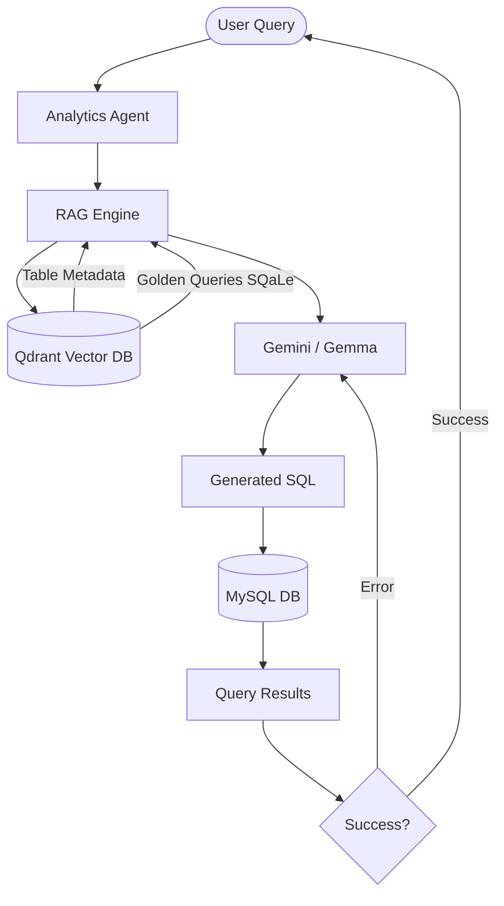

# 🏦 Personal Wealth Banking - Text-to-SQL

A production-grade Text-to-SQL system for the Wealth Management domain. This application allows users to query a complex banking database using natural language, powered by **Gemini/Gemma**, **Qdrant Vector DB**, and **MySQL**.

## 🏗️ System Architecture



---

## 🛠️ Prerequisites

Before you begin, ensure you have the following installed:
*   **Python 3.10+** (Managed via `uv`)
*   **MySQL Server**: Running on `localhost:3306`
*   **Qdrant**: Running on `localhost:6333` (Docker recommended)
*   **Google Gemini API Key**: [Get it here](https://aistudio.google.com/)
*   **Hugging Face Token**: [Get it here](https://huggingface.co/settings/tokens)

---

## 🚀 Step-by-Step Setup

### 1. Initialize the Project
Open your terminal in the project folder and run:
```bash
# Initialize uv environment
uv init

# Install dependencies
uv pip install -r pyproject.toml
```

### 2. Configure Environment Variables
Create a `.env` file in the root directory and fill in your credentials:
```env
# MySQL
DB_HOST=localhost
DB_USER=root
DB_PASSWORD=your_password
DB_NAME=wealth_management

# Qdrant
QDRANT_HOST=localhost
QDRANT_PORT=6333

# Models
EMBEDDING_MODEL=sentence-transformers/all-MiniLM-L6-v2
GENERATION_MODEL=gemini-1.5-flash  # Or your tuned gemma model
GOOGLE_API_KEY=your_gemini_key
HF_TOKEN=your_huggingface_token
```

### 3. Start Local Services
*   **MySQL**: Ensure your service is started.
*   **Qdrant**: Run via Docker for the easiest setup:
    ```bash
    docker run -p 6333:6333 qdrant/qdrant
    ```

### 4. Run the Initial Setup Script
This is a **critical step**. Running this script will:
1.  **Generate Data**: Create `wealth_management` database and Populates your MySQL tables with dummy banking data (Users, Accounts, Transactions, etc.).
2.  **Index Metadata**: Analyzes your schema and stores it in Qdrant for RAG-based table selection.
3.  **Seed Golden Queries**: Streams a subset of the **SQaLe Text-to-SQL dataset** from Hugging Face and indexes it to provide "Few-Shot" examples to the LLM.

```bash
uv run python scripts/setup.py
```

### 5. Launch the Application
Start the interactive analytics agent:
```bash
uv run python main.py
```

---

## 🔍 How It Works

1.  **Retrieval (RAG)**: When you ask a question, the agent searches Qdrant for the most relevant **Table Metadata** and **Golden Queries** (historically correct SQL examples).
2.  **Prompting**: It constructs a high-context prompt containing your schema and examples.
3.  **Generation**: Gemini/Gemma generates a precise SQL query.
4.  **Execution**: The query is run against MySQL.
5.  **Reflection**: If the query fails, the agent takes the error message, reflects on it, and tries to fix the SQL automatically.

## 🤝 Dataset Credit
This project uses the `trl-lab/SQaLe-text-to-SQL-dataset` as a retrieval source to improve query accuracy through few-shot learning.
